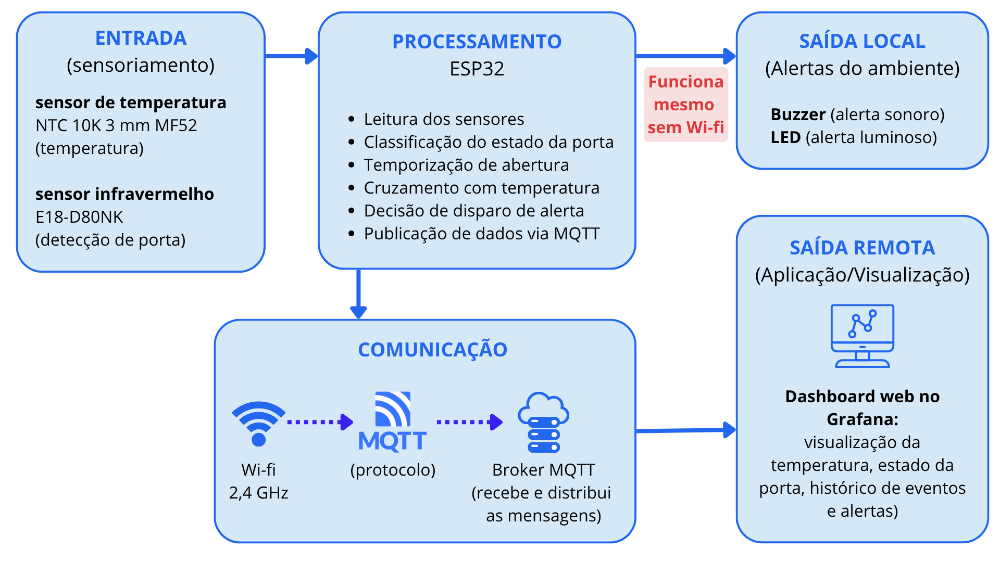
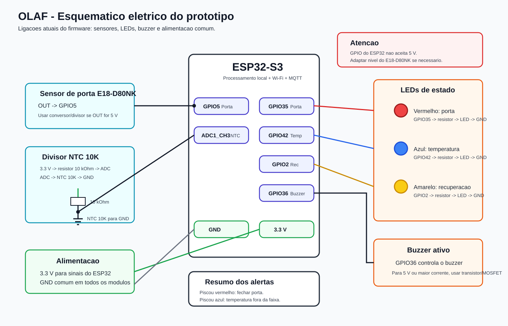

# OLAF - Observador Local de Ambientes Frigorificados

Sistema IoT embarcado para monitoramento preventivo de câmaras frigorificas.

Grupo Lamparina

---

## Apresentação do Projeto

O OLAF é um sistema IoT embarcado desenvolvido para o monitoramento preventivo de ambientes que exigem controle térmico rigoroso, como câmaras frigoríficas e estufas de cura. O projeto busca reduzir o tempo de resposta a situações em que a abertura prolongada ou o fechamento inadequado de uma porta compromete o isolamento térmico, evitando que a identificação do problema ocorra muito tarde, quando produtos ou insumos armazenados já foram danificados. Para isso, a solução utiliza um ESP32, um sensor de temperatura NTC para monitoramento contínuo da temperatura e um sensor fotoelétrico infravermelho para identificação do estado da porta, permitindo iniciar a temporização assim que uma abertura é detectada e relacionar esse tempo ao comportamento térmico do ambiente. Quando uma condição anormal é identificada, o sistema pode acionar alertas locais por LED e buzzer e publicar informações de temperatura, estado da porta e alertas via MQTT, possibilitando também o acompanhamento remoto por meio de um dashboard web.

## Sumário

* [Objetivo](#objetivo)
* [Arquitetura](#arquitetura)
* [Esquemático Elétrico](#esquemático-elétrico)
* [Estrutura do Código](#estrutura-do-código)
* [Hardware Necessário](#hardware-necessario)
* [Ligações Elétricas](#ligações-eletricas)
* [Alertas Locais](#alertas-locais)

  * [LEDs](#leds)
  * [Buzzer](#buzzer)
* [Comunicação MQTT](#comunicação-mqtt)
* [Dashboard no Grafana](#dashboard-no-grafana)
* [Pré-requisitos de Software](#pre-requisitos-de-software)
* [Dependências do Firmware](#dependencias-do-firmware)
* [Instalação e Configuração](#instalação-e-configuração)
  * [1. Preparar o ambiente de desenvolvimento](#1-Preparar-o-ambiente-de-desenvolvimento)
  * [2. Clonar o repositório](#2-clonar-o-repositório)
  * [3. Abrir no VS Code](#3-abrir-no-vs-code)
  * [4. Selecionar o alvo do ESP-IDF](#4-selecionar-o-alvo-do-esp-idf)
  * [5. Configurar Wi-Fi e MQTT](#5-configurar-wi-fi-e-mqtt)
  * [6. Ajustar parâmetros do projeto](#6-ajustar-parâmetros-do-projeto)
* [Como Compilar](#como-compilar)
* [Como Gravar no ESP32](#como-gravar-no-esp32)
* [Como Executar e Monitorar](#como-executar-e-monitorar)
* [Como Confirmar que Funcionou](#como-confirmar-que-funcionou)
* [Solução de Problemas](#solucao-de-problemas)
* [Equipe](#equipe)


## Objetivo
A proposta é identificar situações potencialmente prejudiciais antes que ocorram variações térmicas significativas, contribuindo para a conservação dos produtos e para a redução do esforço do sistema de refrigeração.

O OLAF monitora simultaneamente:

- temperatura interna da câmara;
- estado da porta;
- tempo que a porta permanece aberta;
- período de recuperação térmica após alteração de temperatura;
- alertas locais visuais e sonoros;
- publicação dos dados em um broker MQTT para acompanhamento remoto.

O processamento principal acontece localmente no ESP32. Na versão atual, o firmware tenta conectar ao Wi-Fi na inicialização. Se a conexão falhar depois do número configurado de tentativas, o sistema desiste da rede, ignora o MQTT e inicia mesmo assim em modo local. As regras de porta, temperatura, recuperação, LEDs e buzzer continuam funcionando pelo ESP32.

## Arquitetura

O projeto esta organizado em quatro camadas:

| Camada | Função |
| --- | --- |
| Sensoriamento | Leitura do NTC 10K e detecção do estado da porta pelo E18-D80NK |
| Processamento | ESP32 executando o firmware em ESP-IDF/FreeRTOS |
| Alertas locais | Três LEDs e um buzzer ativo para indicar porta, temperatura e recuperação |
| Comunicação | Wi-Fi e MQTT para enviar dados ao broker e permitir monitoramento remoto |

Fluxo geral:



Documentação complementar:

- [Arquitetura final](docs/arquitetura-final.md)
- [Esquemático elétrico e ligações](docs/esquematico-eletrico.md)

## Esquemático Elétrico



## Estrutura do Código

| Caminho | Responsabilidade |
| --- | --- |
| `main/app_main.c` | Inicializa Wi-Fi, MQTT e controlador principal |
| `components/app_config` | Centraliza GPIOs, limites de temperatura, tempos e constantes do sistema |
| `components/app_controller` | Orquestra leitura dos sensores, lógica de porta, temperatura, recuperação, MQTT e alertas |
| `components/door_sensor` | Leitura e debounce do sensor de porta E18-D80NK |
| `components/temperature_ntc` | Leitura ADC, média das amostras e conversão do NTC para graus Celsius |
| `components/adaptive_timeout` | Cálculo do timeout adaptativo da porta e aprendizado da recuperação térmica |
| `components/alarm` | Controle dos LEDs e do buzzer de forma não bloqueante |
| `components/wifi_component` | Inicialização e conexão Wi-Fi em modo station |
| `components/mqtt_component` | Inicialização, publicação, assinatura e callback MQTT |
| `docs` | Diagramas, esquemático elétrico e documentação auxiliar |

## Hardware Necessario

| Item | Quantidade | Observação |
| --- | ---: | --- |
| ESP32-S3 LoRa V3 ou placa ESP32 compatível | 1 | O projeto atual foi compilado para ESP32-S3 LoRa V3 |
| Sensor NTC 10K MF52 | 1 | Sensor de temperatura |
| Resistor 10 kOhm | 1 | Resistor fixo do divisor de tensao do NTC |
| Sensor de porta E18-D80NK | 1 | Sensor infravermelho usado para detectar porta aberta/fechada |
| Buzzer piezoelétrico ativo | 1 | Alerta sonoro local |
| LED vermelho para porta | 1 | Indica estado/alerta da porta |
| LED azul para temperatura | 1 | Indica faixa de temperatura |
| LED amarelo para recuperação | 1 | Indica janela de recuperação térmica |
| Resistores 220 Ohm ou 330 Ohm | 3 | Limitação de corrente dos LEDs |
| Protoboard ou placa de montagem | 1 | Para protótipo |
| Jumpers | Conforme necessario | Ligações eletricas |
| Fonte 3.3 V/5 V adequada | 1 | Depende da placa e dos sensores usados |
| Cabo USB de dados | 1 | Gravação e monitor serial |

## Ligações Eletricas

Os GPIOs atuais ficam definidos em `components/app_config/app_config.h`.

| Sinal | GPIO atual | Ligação resumida |
| --- | --- | --- |
| Sensor de porta E18-D80NK | GPIO5 | Saída digital do sensor para o GPIO5 |
| NTC 10K | ADC1_CH3 | Ponto central do divisor de tensao ligado ao canal ADC |
| LED vermelho da porta | GPIO35 | GPIO35 -> resistor -> ânodo do LED; cátodo -> GND |
| LED azul de temperatura | GPIO42 | GPIO42 -> resistor -> ânodo do LED; cátodo -> GND |
| LED amarelo de recuperação | GPIO2 | GPIO2 -> resistor -> ânodo do LED; cátodo -> GND |
| Buzzer ativo | GPIO36 | GPIO36 controla o buzzer |

Observações importantes:

- Todos os módulos devem compartilhar o mesmo GND.
- O ESP32 não e tolerante a 5 V nos GPIOs. Se o E18-D80NK estiver alimentado em 5 V e sua saída tambem for 5 V, use divisor resistivo, conversor de nível lógico ou interface adequada antes do GPIO5.
- Para buzzer de maior corrente ou buzzer de 5 V, use transistor/MOSFET de acionamento, resistor de base/gaté adequado e GND comum. Não alimente carga alta diretamente pelo GPIO.
- Veja o guia completo em [docs/esquemático-elétrico.md](docs/esquematico-eletrico.md).

## Alertas Locais

O firmware utiliza tres LEDs independentes e um buzzer ativo.

### LEDs

| LED | Cor recomendada | GPIO atual | Estado | Significado |
| --- | --- | --- | --- | --- |
| Porta | Vermelho | GPIO35 | Apagado | Porta fechada |
| Porta | Vermelho | GPIO35 | Aceso fixo | Porta aberta, ainda dentro do tempo permitido |
| Porta | Vermelho | GPIO35 | Piscando | Porta aberta além do timeout adaptativo; a porta deve ser fechada |
| Temperatura | Azul | GPIO42 | Aceso fixo | Temperatura dentro da faixa aceitavel |
| Temperatura | Azul | GPIO42 | Piscando | Temperatura fora da faixa aceitavel; o sistema esta aguardando recuperação ou ja confirmou alerta térmico |
| Recuperação | Amarelo | GPIO2 | Apagado | Não ha recuperação térmica em andamento |
| Recuperação | Amarelo | GPIO2 | Aceso fixo | Janela de recuperação ativa enquanto a temperatura ainda esta fora da faixa aceitavel |

O período de pisca dos LEDs e definido por `OLAF_LED_BLINK_PERIOD_MS`, atualmente `500 ms`.

### Buzzer

| Situação | Comportamento sonoro | Prioridade |
| --- | --- | --- |
| Porta abriu | Dois bips curtos e rápidos | Baixa |
| Porta fechou | Dois bips curtos e rápidos | Baixa |
| Porta aberta além do timeout | Buzzer alterna 1 segundo ligado e 1 segundo desligado até a porta ser fechada | Alta |
| Temperatura fora da faixa durante recuperação | Buzzer fica silencioso; apenas os LEDs indicam a condição | Nenhuma |
| Recuperação falhou e temperatura continua fora da faixa | Buzzer de temperatura toca alternadamente. Ele toca durante um período equivalente ao tempo de recuperação estimado e depois fica silencioso pelo mesmo período, repetindo o ciclo enquanto o problema persistir | Média |
| Temperatura voltou ao normal | Buzzer de temperatura desliga | - |

A prioridade sonora do sistema e:

1. alerta de porta aberta além do timeout;
2. alerta de temperatura após falha da recuperação;
3. bips curtos de abertura/fechamento da porta.

Isso significa que, se a porta e a temperatura estiverem em alerta ao mesmo tempo, o buzzer primeiro aténde o alerta da porta. Quando a porta for fechada, o sistema volta a considerar o alarme de temperatura, caso ele ainda esteja ativo.

## Comunicação MQTT

O broker e configurado por `idf.py menuconfig` em:

```text
Configuração do Projeto -> MQTT Broker URI
```

Exemplo:

```text
mqtt://broker.hivemq.com
mqtt://192.168.1.100:1883
```

Tópicos usados pelo firmware:

| Tópico | Direção | Payload |
| --- | --- | --- |
| `sensor/temperatura` | Publicação | Temperatura em graus Celsius, exemplo `25.42` |
| `sensor/porta` | Publicação | `aberta` ou `fechada` |
| `sensor/alarme` | Publicação | `1` quando ha alarme de temperatura confirmado, `0` caso contrario |
| `sensor/tempo_porta` | Publicação | Tempo de porta aberta em segundos |
| `sensor/comando` | Assinatura | Tópico reservado para comandos recebidos pelo dispositivo |
| `olaf/status` | Last Will | Publica `offline` se a conexão MQTT cair de forma inesperada |

As publicações usam QoS 1 e retain 0.

Se o Wi-Fi não conectar na inicialização, o sistema entra em modo local: sensores, LEDs e buzzer continuam funcionando, mas os dados não sao publicados no MQTT. O número de tentativas de conexão Wi-Fi e definido no firmware por `WIFI_MAX_RETRY`, atualmente `10`.

## Dashboard no Grafana

O projeto pode ser acompanhado em um dashboard no Grafana usando os dados publicados pelo ESP32 via MQTT.

O fluxo recomendado e:

```text
ESP32 -> Broker MQTT -> Fonte/ponte de dados -> Grafana
```

O Grafana não recebe MQTT diretamente em uma instalação padrão. Para visualizar os dados, use uma das abordagens abaixo:

| Opção | Descrição |
| --- | --- |
| Plugin MQTT/Data Source para Grafana | O Grafana assina os tópicos MQTT por meio de um plugin compatível |
| Node-RED + banco de dados | O Node-RED assina o MQTT e grava em InfluxDB, PostgreSQL ou outro banco; o Grafana le o banco |
| Telegraf + InfluxDB | O Telegraf assina o MQTT, salva no InfluxDB e o Grafana monta os painéis |

Paineis utilizados:

| Painel | Tópico MQTT | Tipo recomendado |
| --- | --- | --- |
| Temperatura atual | `sensor/temperatura` | Gauge ou Time series |
| Estado da porta | `sensor/porta` | Stat |
| Alarme de temperatura | `sensor/alarme` | Stat ou alerta |
| Tempo de porta aberta | `sensor/tempo_porta` | Gauge ou Time series |

Para validar o dashboard, primeiro confirme em um cliente MQTT, como HiveMQ WebSocket Client ou MQTT Explorer, que os tópicos estao recebendo mensagens. Depois conecte esses mesmos tópicos na fonte de dados usada pelo Grafana.

## Pré-requisitos de Software

Para configurar, compilar e executar o projeto, são necessários:

| Ferramenta                    | Versão       |
| ----------------------------- | ------------ |
| Visual Studio Code            | Versão atual |
| Extensão ESP-IDF para VS Code | 2.2.0        |
| ESP-IDF                       | 5.5.5        |
| Git                           | Versão atual |

Também são necessários:

* driver USB compatível com a placa ESP32-S3 LoRa V3;
* cabo USB de dados para gravação e monitoramento serial;
* acesso a uma rede Wi-Fi 2,4 GHz, caso seja utilizada a comunicação remota;
* broker MQTT acessível pela rede local ou pela Internet, caso seja utilizada a comunicação MQTT;
* Grafana ou outra ferramenta de visualização, caso seja utilizado o monitoramento remoto por dashboard.

## Dependências do Firmware

O firmware utiliza componentes fornecidos pelo próprio **ESP-IDF 5.5.5**, não sendo necessária a instalação manual de bibliotecas externas adicionais.

Os principais componentes utilizados são:

| Componente      | Função no projeto                                                 |
| --------------- | ----------------------------------------------------------------- |
| FreeRTOS        | Gerenciamento de tarefas e temporização do sistema                |
| GPIO            | Leitura do sensor de porta e controle dos LEDs e do buzzer        |
| ADC             | Leitura analógica do sensor de temperatura NTC                    |
| ADC Calibration | Calibração das leituras realizadas pelo ADC                       |
| ESP Timer       | Controle das temporizações utilizadas pela lógica do sistema      |
| ESP Log         | Registro de mensagens de execução e diagnóstico no monitor serial |
| ESP Wi-Fi       | Conexão do ESP32 à rede Wi-Fi                                     |
| ESP-MQTT        | Comunicação entre o ESP32 e o broker MQTT                         |

Esses componentes fazem parte do ESP-IDF e são gerenciados pelo próprio sistema de build do framework.

## Instalação e Configuração

### 1. Preparar o ambiente de desenvolvimento

Instale o **Visual Studio Code** e, em seguida, adicione a extensão **ESP-IDF** da Espressif.

Por meio da extensão, configure o **ESP-IDF 5.5.5** e as ferramentas necessárias para compilação e gravação do firmware.

Após a configuração, verifique se o comando `idf.py` está disponível no terminal do ESP-IDF:

```bash
idf.py --version
```

O ambiente deverá reconhecer a instalação do ESP-IDF.


### 2. Clonar o repositório

```bash
git clone <URL_DO_REPOSITORIO>
cd monitoramentor_de_prota
```

### 3. Abrir no VS Code

```bash
code .
```

Também e possivel abrir manualmente pelo menu `Arquivo -> Abrir Pasta`.

### 4. Selecionar o alvo do ESP-IDF

Para ESP32-S3:

```bash
idf.py set-target esp32s3
```

Se a placa usada for outro modelo de ESP32, selecione o alvo correspondente e confira os GPIOs/ADC em `components/app_config/app_config.h`.

### 5. Configurar Wi-Fi e MQTT

Abra o menu de configuração:

```bash
idf.py menuconfig
```

Entre em:

```text
Configuração do Projeto
```

Configure:

| Campo | Exemplo |
| --- | --- |
| `WiFi SSID` | Nome da rede Wi-Fi 2.4 GHz |
| `WiFi Password` | Senha da rede |
| `MQTT Broker URI` | `mqtt://broker.hivemq.com` ou `mqtt://IP_DO_BROKER:1883` |

Salve e saia do menu.

### 6. Ajustar parâmetros do projeto

Os principais parâmetros ficam em:

```text
components/app_config/app_config.h
```

Valores importantes:

| Constante | Função | Valor atual |
| --- | --- | --- |
| `OLAF_TEMP_NORMAL_MAX_C` | Limite superior da faixa aceitavel de temperatura | `35.0f` |
| `OLAF_TIMEOUT_BASE_S` | Timeout inicial da porta aberta | `300.0f` |
| `OLAF_TIMEOUT_MIN_S` | Menor timeout permitido | `30.0f` |
| `OLAF_TIMEOUT_MAX_S` | Maior timeout permitido | `420.0f` |
| `OLAF_RECOVERY_TARGET_S` | Tempo de recuperação usado como referência | `300.0f` |
| `OLAF_LED_BLINK_PERIOD_MS` | Periodo de pisca dos LEDs | `500` |

## Como Compilar

No terminal configurado do ESP-IDF:

```bash
idf.py build
```

Resultado esperado:

```text
Project build complete.
```

## Como Gravar no ESP32

Conecte a placa ao computador via USB e identifique a porta serial.

Windows:

```bash
idf.py -p COMx flash
```

Linux/macOS:

```bash
idf.py -p /dev/ttyUSB0 flash
```

Substitua a porta pelo valor correto do seu computador.

## Como Executar e Monitorar

Para gravar e abrir o monitor serial:

```bash
idf.py -p COMx flash monitor
```

Para abrir somente o monitor:

```bash
idf.py -p COMx monitor
```

Para sair do monitor:

```text
Ctrl + ]
```

## Como Confirmar que Funcionou

No monitor serial, a inicialização correta deve mostrar mensagens semelhantes a:

```text
OLAF - Iniciando sistema
Wi-Fi conectado com sucesso
MQTT iniciado
Controlador OLAF inicializado
Sistema inicializado com sucesso
```

Durante a execução, o firmware registra leituras como:

```text
T=25.40 C | porta=FECHADA | tempo=0.0 s | limite=300.0 s
```

Teste local:

1. Feche a porta/simule o sensor detectando a porta fechada.
2. Abra a porta/simule a ausencia de detecção.
3. Confirme dois bips curtos no buzzer.
4. Confirme LED da porta aceso fixo.
5. Mantenha a porta aberta além do timeout e confirme LED da porta piscando e buzzer alternando.
6. Aqueca o NTC ou simule temperatura acima do limite.
7. Confirme LED de temperatura piscando e LED de recuperação aceso.
8. Confirme que o buzzer de temperatura so dispara se a temperatura não voltar ao normal depois da janela de recuperação.

Teste MQTT com HiveMQ WebSocket Client ou outro cliente MQTT:

1. Conecte o cliente ao mesmo broker configurado no ESP32.
2. Assine os tópicos `sensor/temperatura`, `sensor/porta`, `sensor/alarme`, `sensor/tempo_porta` e `olaf/status`.
3. Ligue o ESP32.
4. Confirme a chegada dos payloads publicados.

## Solução De Problemas

| Problema | Possível causa | Ação recomendada |
| --- | --- | --- |
| `CONFIG_WIFI_SSID vazio` | Wi-Fi não configurado | Rode `idf.py menuconfig` e preencha SSID/senha |
| Wi-Fi não conecta | Rede 5 GHz, senha incorreta ou sinal fraco | Use rede 2.4 GHz e confira credenciais |
| MQTT não conecta | Broker URI incorreto ou sem rede | Teste o broker em outro cliente MQTT e confira URI |
| Sensor de porta invertido | Nivel lógico diferente do esperado | Ajuste `OLAF_DOOR_CLOSED_LEVEL` em `app_config.h` |
| Temperatura muito errada | Canal ADC, divisor ou Beta incorretos | Confira o divisor NTC, `OLAF_NTC_ADC_CHANNEL` e `OLAF_NTC_BETA` |
| LED não acende | Polaridade invertida ou GPIO diferente | Confira resistor, ânodo/cátodo e GPIO |
| Buzzer não toca | Buzzer passivo, ligação incorreta ou corrente insuficiente | Use buzzer ativo ou circuito de acionamento |

## Equipe

Grupo Lamparina

| Integrante |
| --- |
| Francisco Guilherme Cesario Alcantara |
| Guilherme Viana Batista |
| Pedro Henrique Bezerra Simeao |
| Raissa Karoliny da Silva Rodrigues |
