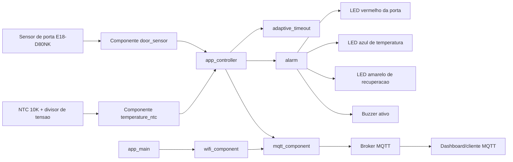
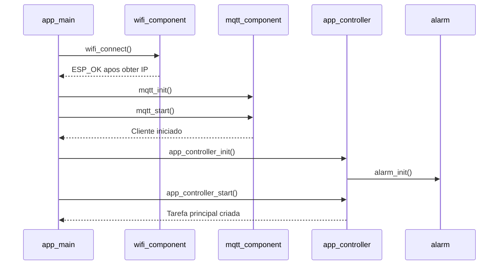
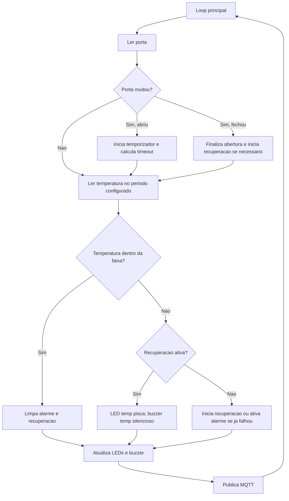

# Arquitetura Final Do OLAF

Este documento descreve a arquitetura final do OLAF para facilitar reproducao, manutencao e avaliacao do projeto.

## Visao Geral

O sistema usa um ESP32 para ler sensores, processar as regras de alerta localmente e enviar dados por MQTT.

## Sequencia De Inicializacao

## Ciclo Principal

A tarefa principal roda periodicamente e executa:

1. leitura/debounce do sensor de porta;
2. deteccao de abertura e fechamento;
3. calculo do timeout adaptativo da porta;
4. leitura do NTC a cada periodo configurado;
5. atualizacao da janela de recuperacao termica;
6. atualizacao dos LEDs e buzzer;
7. publicacao dos estados no MQTT quando o broker esta conectado.

## Componentes De Firmware

| Componente | Papel |
| --- | --- |
| `wifi_component` | Configura NVS, netif, eventos Wi-Fi e conecta em modo station |
| `mqtt_component` | Encapsula cliente MQTT da ESP-IDF |
| `temperature_ntc` | Le ADC, calcula media, resistencia do NTC e temperatura |
| `door_sensor` | Le o GPIO da porta com debounce |
| `adaptive_timeout` | Aprende baseline termico e estima timeout/recuperacao |
| `alarm` | Controla LEDs e buzzer sem bloquear a tarefa principal |
| `app_controller` | Une sensores, regras de negocio, alarmes e MQTT |
| `app_config` | Centraliza constantes de hardware e comportamento |

## Regras De Alerta

### Porta

- porta fechada: LED vermelho da porta apagado;
- porta aberta dentro do limite: LED vermelho da porta aceso fixo;
- porta aberta alem do timeout: LED vermelho da porta piscando e buzzer alternando 1 segundo ligado/1 segundo desligado;
- abertura ou fechamento: dois bips curtos.

### Temperatura

- temperatura normal: LED azul de temperatura aceso fixo;
- temperatura fora da faixa: LED azul de temperatura piscando imediatamente;
- durante recuperacao: LED amarelo de recuperacao aceso e buzzer de temperatura silencioso;
- recuperacao falhou: buzzer de temperatura passa a tocar;
- temperatura voltou ao normal: alarme termico e recuperacao sao cancelados.

### Prioridade Do Buzzer

A prioridade sonora e:

1. alerta de porta aberta alem do timeout;
2. alerta de temperatura apos falha de recuperacao;
3. bips curtos de abertura/fechamento da porta.

Os LEDs funcionam em paralelo, entao porta, temperatura e recuperacao podem ser indicados visualmente ao mesmo tempo.

## MQTT

O envio MQTT acontece depois da leitura de temperatura. Se o cliente MQTT ainda nao estiver conectado, o firmware apenas registra no log e segue mantendo os alertas locais.

Topicos publicados:

- `sensor/temperatura`
- `sensor/porta`
- `sensor/alarme`
- `sensor/tempo_porta`

Topico assinado:

- `sensor/comando`

Last Will:

- topico: `olaf/status`
- mensagem: `offline`
